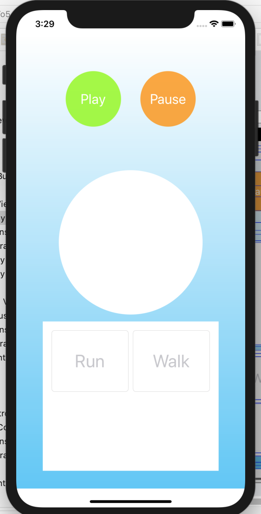
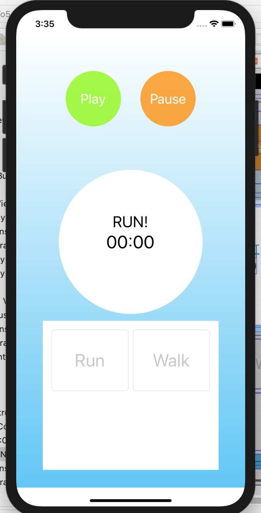
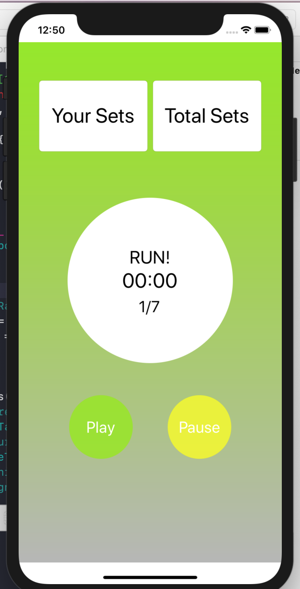
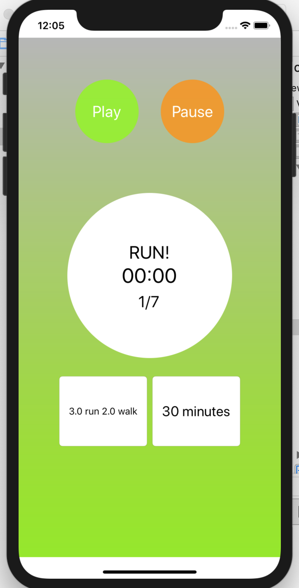
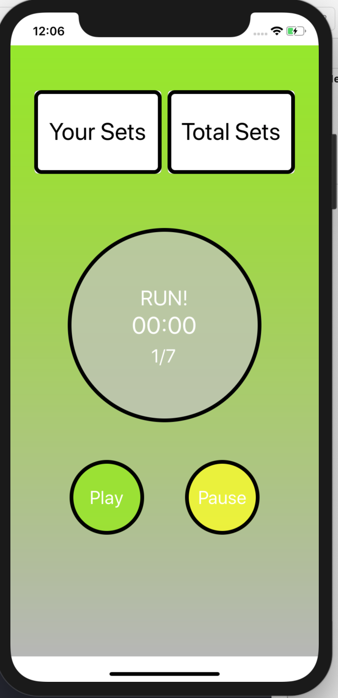

# Run0To5

## Purpose of this app
Hi guys, this is a basic, one view controller app for iOS written in Swift. It is meant to train you to run in intervals from 0 to 5. I just found all other training apps to have too many bells and whistles. 

### Story of building a UI
Decided to share with you guys the journey to building this UI. First draft, progression and ultimately what it looks like right now. you can check out this progression through the commits as well.

I deliberately left the countdown in seconds - instead of formatting to appear in minutes and seconds, because I really want to know how many seconds I have to keep going through this torture we love/hate called running. 

